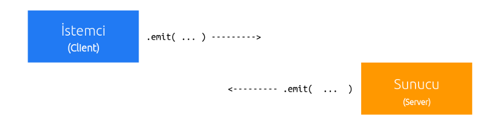

# Patika-Kodluyoruz Real-Time-App

### Bu uygulamanın amacı gerçek zamanda çalışan uygulamayı basitçe anlatabilmekti , gayet güzel bir anlatımda alışverişlerin nasıl olduğunu anlamış bulunmaktayım. öğrendiğim şeyler

- socket.io
- veri alışverişi

## Socket.IO

### Node.js(server) ile Tarayıcı-Browser (client) arasında bilgi alış verişini sağlayan bir soket kütüphanesidir. Soketler bildiğimiz HTTP isteklerinden farklı olarak sunucudan(server) istemciye(client) bir olay sonucu veri gönderebilir.


### Görüldüğü üzere soket her iki taraflı olarak veri iletimi yapabilmektedir.

## Socket.IO kurulum

### İşletim sisteminizden konsolu açıp aşağıdaki npm yükleme komutlarını yazınız.

```js
npm install express
npm install socket.io
```

### Socket.IO Bağlantı Kurulumu


### Sunucudan Bağlantı Kurma

```js
const app = require("express")();
const http = require("http").Server(app);
const io = require("socket.io")(http);
http.listen(3000);
```

### Sunucudan Bağlantı Yakalama

````js
io.on('connection', function(socket){
/*
   Client tarafından bir soket bağlandığında
   Burada [socket] değişkeni ile bu bağlanan soket ile
   veri alış verişini yönetir.
*/
})```
````

### Socketin sahip olduğu id (Sunucudan)

```js
socket.id;
```

### Id’ sini bildiğimiz sockete erişme

```js
io.sockets.connected[__ID__];
```

### Client’den Bağlantı Kurma

```js
export const connectingBackend = () => {
  console.log("server is connecting loading..");

  socket = io("http://localhost:3001/", {
    transports: ["websocket"],
  });
  socket.on("connect", () => console.log("server is connecting successful"));
};
```

### Client’den Bağlantı Yakalama

```js
socket.on("connect", () => console.log("server is connecting successful"));
```

## socket.emit( … )

### Bağlı sokete veri gönderme



```js
socket.on(__OLAY_ADI__, function (__DATA__, __RESPONSE__) {
  console.log("res:", data);
  __RESPONSE__("req");
});
```

```js
// kodlar client dosyası içersindedir .
export const resultBackendMessage = (color) => {
  socket.emit("newColor", color);
};

export const subscribe = (cb) => {
  socket.on("receive", (color) => {
    console.log(color);
    cb(color);
  });
};
```

### **OLAY_ADI** ‘ emit ile beraber gönderilen olay adı, **DATA** yine aynı şekilde .emit( … ) ile beraber gönderdiğimiz veridir. **RESPONSE** burada bir fonksiyon olarak karşımıza çıkıyor. Eğer bir gelen isteğe karşı bir veri göndermek istiyorsanız _RESPONSE_([CEVAP]) ile gönderebilirsiniz.

### Proje başlatma

- Öncelikle her iki klasorü komut isteminde açın ve bağımlı olduğu paketleri indirin

```js
npm install
```

- Bu işlem bittikten sonra 'package.json' dosyasına gittiğinizde "scripts" objesi altındaki komutları arasında size yarayan komutu çalıştırın ve uygulama hazır


### bu bölümü okuduğunuz için teşekkür ederim (thank you) kendinize iyi bakın , görüşürüz (see you)
